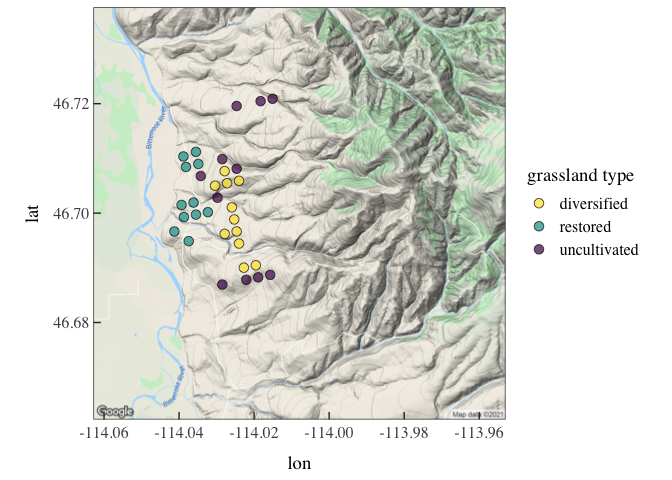
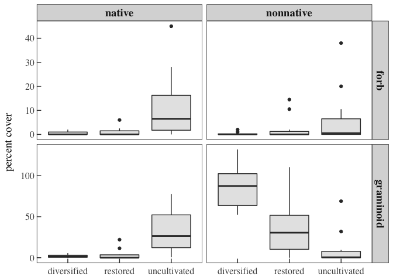
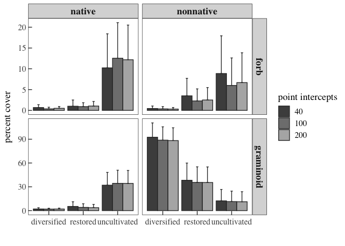

Empirical test of downsampling vegetation data
================
Beau Larkin
2021-03-16

-   [Description](#description)
-   [Resources](#resources)
    -   [Packages, libraries, and
        functions](#packages-libraries-and-functions)
    -   [API keys](#api-keys)
    -   [Global functions and styles:
        `theme_bgl`](#global-functions-and-styles-theme_bgl)
    -   [Data](#data)
-   [Data wrangling](#data-wrangling)
-   [Results](#results)
    -   [Model results](#model-results)
-   [Discussion](#discussion)

# Description

This is the final section of the vegetation methods inquiry. It is
broken into a separate section to speed loading and processing time.

The previous report sections presented rarefaction and bootstrapping
methods to assess the efficiency of our vegetation monitoring protocol.
In this section, a sample of real data is tested for a significant
contrast in plant cover among habitat types, and then these data are
downsampled systematically to fewer numbers of vegetation samples, and
the tests are repeated. Ostensibly, this report will address the
question, “does plant cover in functional groups vary among restored,
diversified, and uncultivated (unrestored) grassland?” The question is
merely a vehicle to facilitate an empirical test of downsampling the
vegetaiton data, and the grid points used in the test were chosen to
maximize contrasts.

# Resources

## Packages, libraries, and functions

Packages and multiple data sources must be added to the local
environment before knitting this notebook.

``` r
# Quick-loading resources
packages_needed = c("tidyverse", "knitr", "rjson", "plotrix", "colorspace", "devtools")
packages_installed = packages_needed %in% rownames(installed.packages())
if (any(!packages_installed))
  install.packages(packages_needed[!packages_installed])
for (i in 1:length(packages_needed)) {
  library(packages_needed[i], character.only = T)
}
```

``` r
# Big R Query
# ggmap package installed from GitHub using `devtools` (not shown)
packages_needed = c("bigrquery", "ggmap") # comma delimited vector of package names
packages_installed = packages_needed %in% rownames(installed.packages())
if (any(!packages_installed))
  install.packages(packages_needed[!packages_installed])
for (i in 1:length(packages_needed)) {
  library(packages_needed[i], character.only = T)
}
```

## API keys

API keys for data access are pulled from local resources and are not
available in the hosted environment. Code not shown here.

## Global functions and styles: `theme_bgl`

``` r
# Load text file from local working directory
source(paste0(getwd(), "/styles.txt"))

# Calculating the 95% CI will aid plotting later
# Uses `plotrix`
ci_95 = function(x) {
  std.error(x) * qnorm(0.975)
}
```

## Data

Data are loaded here, but the code is redundant with the previous
notebook so it is not shown here.

# Data wrangling

Eleven grid points were chosen from each of three grassland habitat
types. The points were chosen from **uncultivated grassland, restored
grassland,** and **forage grass diversification** sites. Points were as
close as possible in proximity and elevation. Vectors with grid point
numbers will be used to filter the vegetation cover data.

``` r
# Grid points in each grassland habitat type
uncult_pts <- c(22, 72, 63, 202, 21, 199, 19, 89, 201, 203, 55)
resto_pts <- c(571, 107, 86, 109, 87, 570, 119, 45, 108, 135, 53)
divers_pts <- c(81, 149, 80, 194, 139, 124, 79, 138, 74, 193, 99)

# Assigning integers to transect points will allow faster downsampling later
trans_pts <-
  data.frame(
    direction = c(rep("E", 50), rep("S", 50), rep("W", 50), rep("N", 50)),
    number = rep(1:50, 4),
    pt_int = 1:200
  ) %>%
  mutate(transect_point = paste0(direction, number))

# `pfg_resto_df` is the core dataset for this exploration
pfg_resto_df <-
  spe_df %>%
  drop_na() %>%
  filter(grid_point %in% c(uncult_pts, resto_pts, divers_pts)) %>%
  left_join(spe_meta_df, by = "key_plant_species") %>%
  left_join(trans_pts, by = "transect_point") %>%
  select(grid_point,
         pt_int,
         plant_native_status,
         plant_life_cycle,
         plant_life_form) %>%
  group_by(grid_point,
           pt_int,
           plant_native_status,
           plant_life_cycle,
           plant_life_form) %>%
  count() %>% ungroup() %>%
  left_join(gp_meta_df %>% select(grid_point, type4_indicators_history),
            by = "grid_point") %>%
  mutate(
    habitat = recode(
      type4_indicators_history,
      `uncultivated grassland native or degraded` = "uncultivated",
      `forage grass restoration` = "restored",
      `forage grass diversification` = "diversified"
    )
  ) %>%
  select(-type4_indicators_history) %>%
  glimpse()
```

    ## Rows: 8,006
    ## Columns: 7
    ## $ grid_point          <int> 19, 19, 19, 19, 19, 19, 19, 19, 19, 19, 19, 19, 19…
    ## $ pt_int              <int> 1, 2, 2, 3, 4, 5, 5, 6, 6, 7, 7, 8, 9, 9, 10, 10, …
    ## $ plant_native_status <chr> "native", "native", "nonnative", "native", "none",…
    ## $ plant_life_cycle    <chr> "perennial", "perennial", "perennial", "perennial"…
    ## $ plant_life_form     <chr> "graminoid", "graminoid", "forb", "graminoid", "no…
    ## $ n                   <int> 1, 1, 1, 1, 1, 1, 1, 1, 1, 1, 1, 2, 1, 1, 1, 1, 1,…
    ## $ habitat             <chr> "uncultivated", "uncultivated", "uncultivated", "u…

# Results

The map below shows the grid points which were used for this test.

``` r
map_data <-
  pfg_resto_df %>%
  distinct(grid_point, habitat) %>%
  left_join(gp_meta_df %>% select(grid_point, lat, long), by = "grid_point")
mpgr_map <- ggmap(get_googlemap(center = c(lon = -114.008, lat = 46.700006),
                                zoom = 13, scale = 2,
                                maptype ='terrain'))     
```

    ## Source : https://maps.googleapis.com/maps/api/staticmap?center=46.700006,-114.008&zoom=13&size=640x640&scale=2&maptype=terrain&key=xxx-4x-49Z5StPBSu3RyhshUzk4

``` r
mpgr_map +
  geom_point(
    data = map_data,
    aes(x = long, y = lat, fill = habitat),
    size = 3,
    shape = 21,
    alpha = 0.7
  ) +
  scale_fill_discrete_sequential(name = "grassland type", palette = "viridis") +
  theme_bgl
```

<!-- -->

Downsampling to fewer point intercepts per grid point involves similar
operations regardless of how many point intercepts are desired, so a
function for this will save space and reduce errors.

-   `d` = divisor to systematically eliminate point intercepts using the
    modulus (`%%`) function
-   `pts` = number of point intercepts desired

``` r
downsample <- function(d, pts) {
  pfg_resto_df %>%
    filter(pt_int %% d == 0) %>%
  group_by(habitat, grid_point, plant_life_cycle, plant_life_form, plant_native_status) %>%
  summarize(pct_cvr = sum(n) / pts * 100, .groups = "drop") %>% ungroup() %>%
  filter(plant_life_cycle == "perennial",
         plant_life_form %in% c("forb", "graminoid"),
         plant_native_status %in% c("native", "nonnative")
  ) %>%
  select(-plant_life_cycle) %>%
  complete(plant_life_form, plant_native_status, nesting(habitat, grid_point), fill = list(pct_cvr = 0))
}

# Apply the `downsample()` function
pfg_200 <- downsample(1, 200)
pfg_100 <- downsample(2, 100)
pfg_40 <- downsample(5, 40)

# Fit ANOVA models with interaction of all terms
aov_200 <-
  aov(pct_cvr ~ habitat * plant_native_status * plant_life_form, data = pfg_200)
aov_100 <-
  aov(pct_cvr ~ habitat * plant_native_status * plant_life_form, data = pfg_100)
aov_40 <-
  aov(pct_cvr ~ habitat * plant_native_status * plant_life_form, data = pfg_40)
```

## Model results

The ANOVA fit to `aov_200` shows the result using all available data.
The data are balanced and orthogonal. In the model result, all terms are
highly significant, including the three-way interaction. These data
violate some assumptions of an ANOVA test, namely normal distributions
and constant variance. These violations might make it unwise to draw
management conclusions from this test, but ANOVA is robust enough
against violated assumptions to at least allow a comparison of model
performance with differently subsetted data.

A visual examination of the data makes the interaction obvious. Cover of
nonnative grasses is relatively low in uncultivated sites and
intermediate in restored sites, but the situation is reversed with the
other functional group combinations.

``` r
summary(aov_200)
```

    ##                                              Df Sum Sq Mean Sq F value   Pr(>F)
    ## habitat                                       2   3234    1617    5.53  0.00504
    ## plant_native_status                           1   7530    7530   25.75 1.43e-06
    ## plant_life_form                               1  21052   21052   72.00 6.63e-14
    ## habitat:plant_native_status                   2  18106    9053   30.96 1.44e-11
    ## habitat:plant_life_form                       2   6350    3175   10.86 4.63e-05
    ## plant_native_status:plant_life_form           1   9001    9001   30.78 1.75e-07
    ## habitat:plant_native_status:plant_life_form   2  14903    7452   25.48 5.97e-10
    ## Residuals                                   120  35087     292                 
    ##                                                
    ## habitat                                     ** 
    ## plant_native_status                         ***
    ## plant_life_form                             ***
    ## habitat:plant_native_status                 ***
    ## habitat:plant_life_form                     ***
    ## plant_native_status:plant_life_form         ***
    ## habitat:plant_native_status:plant_life_form ***
    ## Residuals                                      
    ## ---
    ## Signif. codes:  0 '***' 0.001 '**' 0.01 '*' 0.05 '.' 0.1 ' ' 1

``` r
post200 <- data.frame(TukeyHSD(aov_200)[[7]]) %>% filter(p.adj < 0.05) %>% rownames_to_column()
```

``` r
ggplot(pfg_200, aes(x = habitat, y = pct_cvr)) +
  geom_boxplot(fill = "gray90") +
  facet_grid(
    rows = vars(plant_life_form),
    cols = vars(plant_native_status),
    scales = "free_y"
  ) +
  labs(x = NULL, y = "percent cover") +
  theme_bgl
```

<!-- -->

Downsampling to 100 and 40 point intercepts per grid point, we see very
little change to the model and no conclusions would be altered.

``` r
summary(aov_100)
```

    ##                                              Df Sum Sq Mean Sq F value   Pr(>F)
    ## habitat                                       2   3268    1634   5.419  0.00558
    ## plant_native_status                           1   7455    7455  24.726 2.22e-06
    ## plant_life_form                               1  21637   21637  71.765 7.14e-14
    ## habitat:plant_native_status                   2  18679    9339  30.976 1.42e-11
    ## habitat:plant_life_form                       2   6324    3162  10.488 6.34e-05
    ## plant_native_status:plant_life_form           1   9267    9267  30.736 1.79e-07
    ## habitat:plant_native_status:plant_life_form   2  14739    7369  24.443 1.25e-09
    ## Residuals                                   120  36180     302                 
    ##                                                
    ## habitat                                     ** 
    ## plant_native_status                         ***
    ## plant_life_form                             ***
    ## habitat:plant_native_status                 ***
    ## habitat:plant_life_form                     ***
    ## plant_native_status:plant_life_form         ***
    ## habitat:plant_native_status:plant_life_form ***
    ## Residuals                                      
    ## ---
    ## Signif. codes:  0 '***' 0.001 '**' 0.01 '*' 0.05 '.' 0.1 ' ' 1

``` r
post100 <- data.frame(TukeyHSD(aov_100)[[7]]) %>% filter(p.adj < 0.05) %>% rownames_to_column()
summary(aov_40)
```

    ##                                              Df Sum Sq Mean Sq F value   Pr(>F)
    ## habitat                                       2   3142    1571   4.634   0.0116
    ## plant_native_status                           1   9713    9713  28.644 4.44e-07
    ## plant_life_form                               1  22446   22446  66.194 5.13e-13
    ## habitat:plant_native_status                   2  17054    8527  25.147 8.47e-10
    ## habitat:plant_life_form                       2   7102    3551  10.472 6.59e-05
    ## plant_native_status:plant_life_form           1   9453    9453  27.878 6.11e-07
    ## habitat:plant_native_status:plant_life_form   2  16418    8209  24.210 1.63e-09
    ## Residuals                                   116  39334     339                 
    ##                                                
    ## habitat                                     *  
    ## plant_native_status                         ***
    ## plant_life_form                             ***
    ## habitat:plant_native_status                 ***
    ## habitat:plant_life_form                     ***
    ## plant_native_status:plant_life_form         ***
    ## habitat:plant_native_status:plant_life_form ***
    ## Residuals                                      
    ## ---
    ## Signif. codes:  0 '***' 0.001 '**' 0.01 '*' 0.05 '.' 0.1 ' ' 1

``` r
post40 <- data.frame(TukeyHSD(aov_40)[[7]]) %>% filter(p.adj < 0.05) %>% rownames_to_column()
```

Post-hoc analysis with a three-way interaction term is difficult to
interpret and beyond the scope of this report. Interpretation isn’t
necessary to show that similar performance of downsampled models carries
through to pairwise contrasts.

``` r
post <-
  bind_rows(
    "200" = post200,
    "100" = post100,
    "40" = post40,
    .id = "sampled"
  )
```

``` r
pivot_wider(
  post[,-c(3, 4, 5)],
  values_from = p.adj,
  names_from = sampled,
  names_prefix = "pt_int_"
) %>%
  kable(format = "pandoc")
```

| rowname                                                          | pt\_int\_200 | pt\_int\_100 | pt\_int\_40 |
|:-----------------------------------------------------------------|-------------:|-------------:|------------:|
| uncultivated:native:graminoid-diversified:native:forb            |    0.0005538 |    0.0006486 |   0.0061502 |
| diversified:nonnative:graminoid-diversified:native:forb          |    0.0000000 |    0.0000000 |   0.0000000 |
| restored:nonnative:graminoid-diversified:native:forb             |    0.0002952 |    0.0003419 |   0.0004904 |
| uncultivated:native:graminoid-restored:native:forb               |    0.0007447 |    0.0008665 |   0.0097964 |
| diversified:nonnative:graminoid-restored:native:forb             |    0.0000000 |    0.0000000 |   0.0000000 |
| restored:nonnative:graminoid-restored:native:forb                |    0.0004001 |    0.0004604 |   0.0008716 |
| diversified:nonnative:graminoid-uncultivated:native:forb         |    0.0000000 |    0.0000000 |   0.0000000 |
| uncultivated:native:graminoid-diversified:nonnative:forb         |    0.0005013 |    0.0006486 |   0.0055579 |
| diversified:nonnative:graminoid-diversified:nonnative:forb       |    0.0000000 |    0.0000000 |   0.0000000 |
| restored:nonnative:graminoid-diversified:nonnative:forb          |    0.0002666 |    0.0003419 |   0.0004381 |
| uncultivated:native:graminoid-restored:nonnative:forb            |    0.0016094 |    0.0017580 |   0.0266769 |
| diversified:nonnative:graminoid-restored:nonnative:forb          |    0.0000000 |    0.0000000 |   0.0000000 |
| restored:nonnative:graminoid-restored:nonnative:forb             |    0.0008835 |    0.0009536 |   0.0027462 |
| uncultivated:native:graminoid-uncultivated:nonnative:forb        |    0.0124114 |    0.0106182 |          NA |
| diversified:nonnative:graminoid-uncultivated:nonnative:forb      |    0.0000000 |    0.0000000 |   0.0000000 |
| restored:nonnative:graminoid-uncultivated:nonnative:forb         |    0.0073225 |    0.0061426 |   0.0192426 |
| uncultivated:native:graminoid-diversified:native:graminoid       |    0.0012388 |    0.0014593 |   0.0111216 |
| diversified:nonnative:graminoid-diversified:native:graminoid     |    0.0000000 |    0.0000000 |   0.0000000 |
| restored:nonnative:graminoid-diversified:native:graminoid        |    0.0006749 |    0.0007871 |   0.0009548 |
| uncultivated:native:graminoid-restored:native:graminoid          |    0.0029457 |    0.0043385 |          NA |
| diversified:nonnative:graminoid-restored:native:graminoid        |    0.0000000 |    0.0000000 |   0.0000000 |
| restored:nonnative:graminoid-restored:native:graminoid           |    0.0016478 |    0.0024247 |   0.0058811 |
| diversified:nonnative:graminoid-uncultivated:native:graminoid    |    0.0000000 |    0.0000000 |   0.0000000 |
| restored:nonnative:graminoid-diversified:nonnative:graminoid     |    0.0000000 |    0.0000000 |   0.0000000 |
| uncultivated:nonnative:graminoid-diversified:nonnative:graminoid |    0.0000000 |    0.0000000 |   0.0000000 |
| restored:nonnative:graminoid-uncultivated:native:forb            |           NA |           NA |   0.0325028 |

With the results of Tukey’s HSD post-hoc test filtered to *p* values
less than 0.05 and only contrasts with three-way interactions
considered, little difference is apparent between data sets averaged
from 200, 100, or 40 point intercepts. Between data sets with 200 or 100
point intercepts, *p* values mostly remain in the same order of
magnitude. With the data set filtered to 40 point intercepts, the *p*
values increase by roughly an order of magnitude, again signaling some
increased volatility in means. Graphically, it appears that the means
and confidence intervals at 200 and 100 point intercepts are very
similar. At 40 point intercepts, the mean shows increased volatility and
confidence intervals increase.

``` r
pfg_means <-
  bind_rows(
    "40" = pfg_40,
    "100" = pfg_100,
    "200" = pfg_200,
    .id = "pt_int"
  ) %>%
  mutate(pt_int = factor(pt_int, levels = c("40", "100", "200"))) %>%
  group_by(pt_int, habitat, plant_life_form, plant_native_status) %>%
  summarize(
    mean_pct_cvr = mean(pct_cvr),
    ci_pct_cvr = ci_95(pct_cvr),
    .groups = "drop"
  )
```

``` r
ggplot(pfg_means, aes(x = habitat, y = mean_pct_cvr, group = pt_int)) +
  geom_col(aes(fill = pt_int),
           color = "gray20",
           position = position_dodge(width = 0.9)) +
  geom_errorbar(
    aes(ymin = mean_pct_cvr, ymax = mean_pct_cvr + ci_pct_cvr),
    color = "gray20",
    width = 0.2,
    position = position_dodge(width = 0.9)
  ) +
  facet_grid(
    rows = vars(plant_life_form),
    cols = vars(plant_native_status),
    scales = "free_y"
  ) +
  scale_fill_manual(name = "point intercepts",
                    values = c("gray30", "gray50", "gray70")) +
  labs(x = "", y = "percent cover") +
  theme_bgl
```

<!-- -->

# Discussion

The final report will contain more interpretation, but for now it is
important to restate that this is a crude application of an ANOVA, and a
three-way interaction would be difficult to interpret under the best of
circumstances. What we can show here is that the vegetation monitoring
data seems to capture differences in plant functional group cover well
at greatly reduced sampling frequencies.

This doesn’t inform what the effect of downsampling would be on analysis
of multivariate plant community data. Presumably, rare species would be
lost with downsampling, and the consequences of that are hard to
predict. Also, even with a plan to separate means of cover in functional
groups, it’s unlikely that a real case would be as ideal as these test
data are, and assumptions of model fit would need to be better observed.
