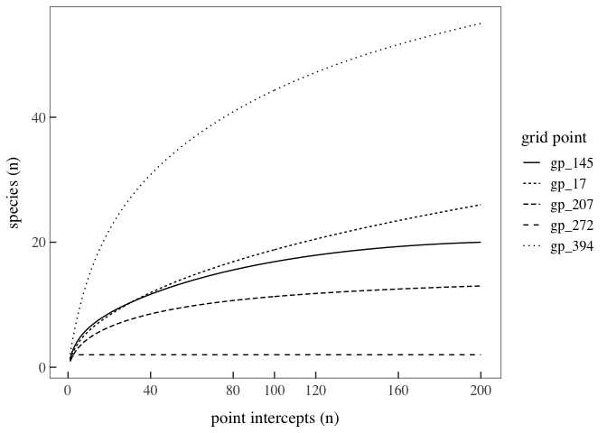
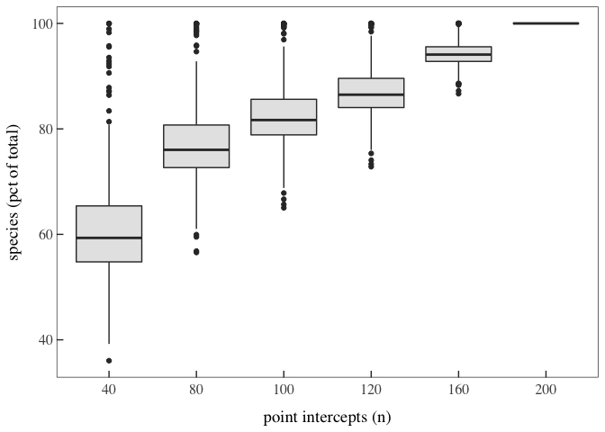
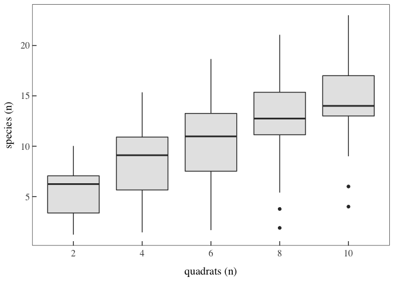

Vegetation Survey at MPG Ranch: Efficiency and Recommendations
================
Beau Larkin
2021-03-06

-   [Description](#description)
-   [Resources](#resources)
    -   [Package and library
        installation](#package-and-library-installation)
    -   [API keys](#api-keys)
    -   [Global functions and styles](#global-functions-and-styles)
-   [Source data](#source-data)
    -   [Point-intercept species data](#point-intercept-species-data)
    -   [Point-intercept ground cover
        data](#point-intercept-ground-cover-data)
    -   [Quadrat-based species data](#quadrat-based-species-data)
    -   [Vegetation species metadata](#vegetation-species-metadata)
    -   [Grid point metadata](#grid-point-metadata)
-   [Survey efficiency: species
    richness](#survey-efficiency-species-richness)
    -   [Data wrangling and analysis](#data-wrangling-and-analysis)
    -   [Results](#results)

# Description

On February 27, 2020, Rebecca Durham, Craig Jourdonnais, Beau Larkin,
Dean Pearson, Phil Ramsey, and Mike McTee began a discussion about
whether our vegetation survey methods need revision. After that meeting,
we identified several needs for additional investigation and discussion.

-   [link](https://docs.google.com/document/d/1yCLPai5r4z5nxyimmbRF-I2Gugzn_jgBFV2wpemR0IM/edit?usp=sharing)
    to meeting notes from 2020-02-27
-   [link](https://docs.google.com/document/d/1UfM6ueUNCGtW0-PY8FUWc7vRSBwrFTfDtZdI5gUv35s/edit?usp=sharing)
    to report on proposed revisions to vegetation survey methods

This document is intended to curate the code, analysis, and results
presented in the report on proposed revisions to vegetation methods.

# Resources

## Package and library installation

``` r
## Quick-loading resources
packages_needed = c("tidyverse", "knitr", "rjson", "vegan", "plotrix")
packages_installed = packages_needed %in% rownames(installed.packages())
if (any(!packages_installed))
  install.packages(packages_needed[!packages_installed])
for (i in 1:length(packages_needed)) {
  library(packages_needed[i], character.only = T)
}
```

    ## ── Attaching packages ─────────────────────────────────────── tidyverse 1.3.0 ──

    ## ✓ ggplot2 3.3.3     ✓ purrr   0.3.4
    ## ✓ tibble  3.1.0     ✓ dplyr   1.0.5
    ## ✓ tidyr   1.1.3     ✓ stringr 1.4.0
    ## ✓ readr   1.4.0     ✓ forcats 0.5.0

    ## ── Conflicts ────────────────────────────────────────── tidyverse_conflicts() ──
    ## x dplyr::filter() masks stats::filter()
    ## x dplyr::lag()    masks stats::lag()

    ## Loading required package: permute

    ## Loading required package: lattice

    ## This is vegan 2.5-7

``` r
## Big R Query (slow loading)
packages_needed = c("bigrquery") # comma delimited vector of package names
packages_installed = packages_needed %in% rownames(installed.packages())
if (any(!packages_installed))
  install.packages(packages_needed[!packages_installed])
for (i in 1:length(packages_needed)) {
  library(packages_needed[i], character.only = T)
}
```

## API keys

API keys for data access are pulled from local resources and are not
available in the hosted environment. Code not shown here.

## Global functions and styles

``` r
## Load text file of styles from Google Drive
source(fromJSON(file = paste0(getwd(), "/R_globalKeys.json"))$stylesKey)

## Calculating the 95% CI will aid plotting later
## Uses `plotrix`
ci_95 = function(x){std.error(x) * qnorm(0.975)}
```

# Source data

## Point-intercept species data

Make raw data available locally by pulling from the MPG Data Warehouse
and then pre-process to create two objects that will be joined with
metadata and used for analysis

``` r
spe_pull_sql <-
  "
  SELECT *
  FROM `mpg-data-warehouse.vegetation_point_intercept_gridVeg.gridVeg_point_intercept_vegetation`
  WHERE year = 2016
  "
spe_pull_bq <- bq_project_query(billing, spe_pull_sql)
spe_pull_tb <- bq_table_download(spe_pull_bq)
spe_pull_df <- as.data.frame(spe_pull_tb) %>% glimpse()
```

    ## Rows: 114,193
    ## Columns: 10
    ## $ survey_ID          <chr> "012C5FAD-2451-41B0-9E2F-432D1ECEB55C", "012C5FAD-2…
    ## $ grid_point         <int> 285, 285, 285, 285, 285, 285, 285, 285, 285, 285, 2…
    ## $ date               <date> 2016-05-31, 2016-05-31, 2016-05-31, 2016-05-31, 20…
    ## $ year               <int> 2016, 2016, 2016, 2016, 2016, 2016, 2016, 2016, 201…
    ## $ transect_point     <chr> "S31", "W39", "E50", "S17", "N10", "N34", "N21", "S…
    ## $ height_intercept_1 <dbl> 12, 10, 25, 15, 10, 15, 20, 22, 30, 20, 40, 40, 30,…
    ## $ intercept_1        <int> 428, 415, 428, 307, 308, 307, 428, 428, 141, 428, 4…
    ## $ intercept_2        <int> NA, 82, 82, 428, NA, NA, NA, 82, NA, NA, 411, NA, 1…
    ## $ intercept_3        <int> NA, NA, NA, NA, NA, NA, NA, NA, NA, NA, NA, NA, 82,…
    ## $ intercept_4        <int> NA, NA, NA, NA, NA, NA, NA, NA, NA, NA, NA, NA, NA,…

Note that in `spe_pull_df`, with 200 intercepts per grid point, the
total number of records indicated here should not be possible. Under
investigation, I found that 7 grid points contain only 199 records, so
no correction to the data is possible. For this analysis, a small number
of missing records should not affect the interpretation.

### Species data must be transformed to long-form to enable filtering

T code “NV” or “no vegetation” is present and may be treated as a
species unless removed or treated differently. NV should be removed for
species richness calculations, but should be retained for functional
group cover calculations.

In the imported data, many NA values exist in intercept hits 2-4. These
aren’t coded “NV”. These NA values are treated differently depending on
how the species data are used, and so are left in the data frame for
now.

``` r
spe_df <-
  spe_pull_df %>%
  select(grid_point, transect_point, starts_with("intercept")) %>%
  pivot_longer(starts_with("intercept"),
               names_to = "intercept",
               values_to = "key_plant_species") %>%
  glimpse()
```

    ## Rows: 456,772
    ## Columns: 4
    ## $ grid_point        <int> 285, 285, 285, 285, 285, 285, 285, 285, 285, 285, 28…
    ## $ transect_point    <chr> "S31", "S31", "S31", "S31", "W39", "W39", "W39", "W3…
    ## $ intercept         <chr> "intercept_1", "intercept_2", "intercept_3", "interc…
    ## $ key_plant_species <int> 428, NA, NA, NA, 415, 82, NA, NA, 428, 82, NA, NA, 3…

### Height data must be stripped from species data frame to use separately

``` r
ht_df <-
  spe_pull_df %>%
  select(grid_point, transect_point, height_intercept_1) %>%
  glimpse()
```

    ## Rows: 114,193
    ## Columns: 3
    ## $ grid_point         <int> 285, 285, 285, 285, 285, 285, 285, 285, 285, 285, 2…
    ## $ transect_point     <chr> "S31", "W39", "E50", "S17", "N10", "N34", "N21", "S…
    ## $ height_intercept_1 <dbl> 12, 10, 25, 15, 10, 15, 20, 22, 30, 20, 40, 40, 30,…

## Point-intercept ground cover data

Wrangling will be handled later during analysis

``` r
grcov_pull_sql <-
  "
  SELECT *
  FROM `mpg-data-warehouse.vegetation_point_intercept_gridVeg.gridVeg_point_intercept_ground`
  WHERE year = 2016
  "
grcov_pull_bq <- bq_project_query(billing, grcov_pull_sql)
grcov_pull_tb <- bq_table_download(grcov_pull_bq)
grcov_pull_df <-
  as.data.frame(grcov_pull_tb) %>%
  select(grid_point, transect_point, intercept_ground_code) %>%
  glimpse()
```

    ## Rows: 114,193
    ## Columns: 3
    ## $ grid_point            <int> 285, 285, 285, 285, 285, 285, 285, 285, 285, 285…
    ## $ transect_point        <chr> "N34", "N21", "E50", "S19", "E24", "W28", "N43",…
    ## $ intercept_ground_code <chr> "G", "L", "L", "L", "BV", "BV", "L", "L", "L", "…

## Quadrat-based species data

The quadrat data comes from the survey known as “YVP”. It is used here
to demonstrate how many species may be recovered by combining
point-intercept and quadrat methods.

``` r
qspe_pull_sql <-
  "
  SELECT *
  FROM `mpg-data-warehouse.vegetation_fixed_plot_yvp.yvp_vegetation_cover`
  WHERE (plot_loc <> 'N' OR plot_loc IS NULL)
  AND date BETWEEN '2017-01-01' AND '2017-12-31'
  "
qspe_pull_bq <- bq_project_query(billing, qspe_pull_sql)
qspe_pull_tb <- bq_table_download(qspe_pull_bq)
qspe_pull_df <- as.data.frame(qspe_pull_tb) %>% glimpse()
```

    ## Rows: 3,267
    ## Columns: 9
    ## $ plot_code         <chr> "YVP 468", "YVP 468", "YVP 468", "YVP 468", "YVP 468…
    ## $ plot_loc          <chr> NA, NA, NA, NA, NA, NA, NA, NA, NA, NA, NA, NA, NA, …
    ## $ plot_rep          <chr> NA, NA, NA, NA, NA, NA, NA, NA, NA, NA, NA, NA, NA, …
    ## $ grid_point        <int> 468, 468, 468, 468, 468, 468, 468, 468, 468, 468, 46…
    ## $ date              <date> 2017-07-06, 2017-07-06, 2017-07-06, 2017-07-06, 201…
    ## $ subplot           <int> 1, 1, 1, 1, 1, 1, 1, 1, 2, 2, 2, 2, 2, 2, 2, 3, 3, 3…
    ## $ key_plant_species <int> 745, 14, 199, 230, 297, 406, 410, 434, 14, 113, 199,…
    ## $ key_plant_code    <chr> "AGRO_SP", "AGRSTO", "ELYREP", "EUPESU", "LEUVUL", "…
    ## $ cover_pct         <dbl> 4, 4, 20, 20, 3, 15, 30, 2, 3, 5, 10, 15, 3, 20, 35,…

## Vegetation species metadata

This dataset contains plant functional groups and other metadata
associated with plant species.

``` r
spe_meta_sql <-
  "
  SELECT key_plant_species, key_plant_code, plant_native_status, plant_life_cycle, plant_life_form, plant_name_sci, plant_name_common
  FROM `mpg-data-warehouse.vegetation_species_metadata.vegetation_species_metadata`
  "
spe_meta_bq <- bq_project_query(billing, spe_meta_sql)
spe_meta_tb <- bq_table_download(spe_meta_bq)
spe_meta_df <- as.data.frame(spe_meta_tb) %>% glimpse()
```

    ## Rows: 754
    ## Columns: 7
    ## $ key_plant_species   <int> 655, 650, 571, 82, 530, 78, 687, 39, 489, 620, 373…
    ## $ key_plant_code      <chr> "VENDUB", "ZIZPAL", "VULOCT", "BROTEC", "TRIAES", …
    ## $ plant_native_status <chr> "nonnative", "native", "native", "nonnative", "non…
    ## $ plant_life_cycle    <chr> "annual", "annual", "annual", "annual", "annual", …
    ## $ plant_life_form     <chr> "graminoid", "graminoid", "graminoid", "graminoid"…
    ## $ plant_name_sci      <chr> "Ventenata dubia", "Zizania palustris", "Vulpia oc…
    ## $ plant_name_common   <chr> "North Africa grass", "northern wildrice", "sixwee…

## Grid point metadata

This dataset contains habitat types and spatial metadata for grid
points.

``` r
gp_meta_sql <-
  "
  SELECT *
  FROM `mpg-data-warehouse.grid_point_summaries.location_position_classification`
  "
gp_meta_bq <- bq_project_query(billing, gp_meta_sql)
gp_meta_tb <- bq_table_download(gp_meta_bq)
gp_meta_df <- as.data.frame(gp_meta_tb) %>% glimpse()
```

    ## Rows: 582
    ## Columns: 16
    ## $ grid_point                  <int> 1, 2, 3, 4, 5, 6, 7, 8, 9, 10, 11, 12, 13,…
    ## $ lat                         <dbl> 46.73193, 46.72972, 46.72443, 46.72487, 46…
    ## $ long                        <dbl> -114.0017, -114.0010, -114.0227, -114.0195…
    ## $ aspect_mean_deg             <dbl> 334.7050, 45.3030, 221.3340, 290.4890, 288…
    ## $ aspect_direction            <chr> "NNW", "NE", "SW", "WNW", "WNW", "WNW", "W…
    ## $ aspect_northness            <dbl> 0.9041197, 0.7033575, -0.7508724, 0.350027…
    ## $ aspect_eastness             <dbl> -0.4272792, 0.7108363, -0.6604474, -0.9367…
    ## $ elevation_mean_m            <dbl> 1395.64, 1456.09, 1126.90, 1166.33, 1179.5…
    ## $ slope_mean_deg              <dbl> 28.44230, 12.22630, 4.25130, 2.68361, 4.26…
    ## $ cover_type_2016_gridVeg     <chr> "woodland/forest", "non-irrigated grasslan…
    ## $ biomass_habitat_type        <chr> NA, "Range", "Range", "Range", "Range", "R…
    ## $ type1_biome                 <chr> "forest", "rangeland", "rangeland", "range…
    ## $ type2_vegetation_community  <chr> "upland", "grassland", "grassland", "grass…
    ## $ type3_vegetation_indicators <chr> "mixed canopy conifer", "uncultivated gras…
    ## $ type4_indicators_history    <chr> "mixed canopy conifer", "uncultivated gras…
    ## $ mgmt_unit_habitat           <chr> "conifer_forest", "grassland_native__invad…

### Vector of grid points in grassland

This is an additional grid point metadata item. It is useful for quickly
filtering grid points to grassland habitats without having to use
`left_join()` to associate metadata with vegetation data.

``` r
grass_pts <- gp_meta_df %>% 
  filter(type3_vegetation_indicators == "uncultivated grassland native or degraded") %>% 
  pull(grid_point)
```

# Survey efficiency: species richness

## Data wrangling and analysis

### Point-intercept data

The species data must be transformed into samples-species matrices for
each grid point. `Split()` facilitates this by separating each grid
point into a separate list object. The resulting list is then passed to
a function with `lapply()` to create the samples-species matrices.

Where `key_plant_code = NV`, special treatment must be considered to
prevent the species accumulation to consider that “NV” is a species. NA
values are recoded to “NV”, and after pivoting each table to a
samples-species matrix, the column “NV” is simply removed. This answers
the immediate need to prevent including “NV” with species, but it also
preserves the number of rows in each list object (200 rows in all but
seven cases). This will make sure that species rarefaction reaches to
the actual species richness detected at each grid point. If “NV” rows
were simply filtered out of the original long-form dataset, many grid
points would have fewer than 200 rows, and the richness would cease
accumulating before the actual richness measured was reached.

``` r
spe_list<-
  spe_df %>%
  replace_na(list(key_plant_species = 360)) %>% 
  select(-intercept) %>%
  left_join(spe_meta_df %>% select(key_plant_species, key_plant_code), by = "key_plant_species") %>%
  select(-key_plant_species) %>%
  mutate(detected = 1) %>%
  split(paste0("gp_", factor(spe_df$grid_point)))

spe_mat_list <-
  lapply(spe_list, function(x) {
    data.frame(
      x %>%
        pivot_wider(
          names_from = key_plant_code,
          values_from = detected,
          values_fn = min,
          values_fill = 0
        ) %>%
        arrange(transect_point) %>%
        select(-NV,-grid_point),
      row.names = 1
    )
  })
```

Next, the list is passed to another function with `lapply()`, this time
to calculate the species rarefaction on each samples-species matrix.
Species rarefaction is predicted at known sampling efforts, which
correspond with the number of pin drops. The vector `sample_points`
controls the desired rarefaction of species richness data.

``` r
sample_points <- c(200, 160, 120, 100, 80, 40)

spe_fun = function(x) {
  data.frame(
    sample_points = factor(sample_points),
    pred = specaccum(x, method = "rarefaction") %>% predict(., newdata = sample_points)
  )
}

## Rarefy the species data (this step takes a few minutes).
spe_pred <-
  lapply(spe_mat_list, spe_fun) %>%
  bind_rows(.id = "id") %>%
  group_by(id) %>%
  mutate(pred_pct = (pred / max(pred)) * 100) %>%
  ungroup() %>%
  separate(id, into = c(NA, "grid_point"), sep = "_", remove = FALSE)
```

### Quadrat data

The rarefaction of species data from point-intercept surveys can be
compared with a similar analysis of quadrat-based survey data. Quadrat
methods have detected different suites of species than point-intercept
methods have
[report](https://docs.google.com/document/d/1UfM6ueUNCGtW0-PY8FUWc7vRSBwrFTfDtZdI5gUv35s/edit?usp=sharing),
suggesting that it may be advisable to combine quadrats with
point-intercepts. To investigate this, a rarefaction is also performed
with the quadrat data (`qspe`), but before rarefying, the species are
filtered to include only those which were detected by quadrats but not
by point-intercepts. The results will show how many species might be
added to point-intercept surveys by the number of quadrats added.

``` r
## The code here closely follows the previous code for point-intercept data,
## but because some column names and other variables differ slightly, 
## the functions are repeated with slight edits insetad of being handled 
## programatically. 
qspe_filter <-
  qspe_pull_df %>% 
  select(grid_point, subplot, key_plant_species, key_plant_code) %>% 
  anti_join(spe_df, by = c("grid_point", "key_plant_species")) %>% 
  select(-key_plant_species) %>% 
  mutate(detected = 1)
  
qspe_list <-  
  split(qspe_filter, paste0("gp_", factor(qspe_filter$grid_point)))

qspe_mat_list <-
  lapply(qspe_list, function(x) {
    data.frame(
      x %>%
        pivot_wider(
          names_from = key_plant_code,
          values_from = detected,
          values_fn = min,
          values_fill = 0
        ) %>%
        arrange(subplot) %>%
        select(-grid_point),
      row.names = 1
    )
  })

## Rarefy species for desired number of quadrats
quads <- c(10, 8, 6, 4, 2)

qspe_fun = function(x) {
  data.frame(
    quads = factor(quads),
    pred = specaccum(x, method = "rarefaction") %>% predict(., newdata = quads)
  )
}

## This is where the accumulations at desired points is calculated
qspe_pred <-
  lapply(qspe_mat_list, qspe_fun) %>%
  bind_rows(.id = "id") %>%
  group_by(id) %>%
  mutate(pred_pct = (pred / max(pred)) * 100) %>%
  ungroup() %>%
  separate(id,
           into = c(NA, "grid_point"),
           sep = "_",
           remove = FALSE)
## 13 rows of predicted values are missing because (presumably) some quadrats detected
## no species that weren't also detected by point-intercept surveys
```

## Results

### Example rarefaction curves

The following code and produces rarefaction curves from five grid
points, representing the quantiles of total species richness across the
survey. The figure provides an example of the range of species
accumulation at points across the ranch.

``` r
## Subset richness data to five grid points with a range of species richness
rows_spe_pred <-
  spe_pred %>% drop_na() %>% filter(sample_points == 200)
example_rows <-
  trunc(dim(rows_spe_pred)[1] * c(1 / dim(rows_spe_pred)[1], 0.25, 0.50, 0.75, 1.00))
example_gp <-
  rows_spe_pred %>%
  arrange(pred) %>%
  slice(example_rows) %>%
  pull(id)
## Filter the example data from `spe_mat_list`
example_curves <-
  data.frame(
    c(1:200),
    specaccum(spe_mat_list[[example_gp[1]]])$richness,
    specaccum(spe_mat_list[[example_gp[2]]])$richness,
    specaccum(spe_mat_list[[example_gp[3]]])$richness,
    specaccum(spe_mat_list[[example_gp[4]]])$richness,
    specaccum(spe_mat_list[[example_gp[5]]])$richness
  )
names(example_curves) <- c("sample_points", example_gp)
## The figure shows a range of species accumulation across the surveyed grid points
ggplot(
  data = example_curves %>% pivot_longer(-sample_points, names_to = "grid_pt"),
  aes(x = sample_points, y = value, group = grid_pt)
) +
  geom_line(aes(linetype = grid_pt)) +
  scale_linetype(name = "grid point") +
  scale_x_continuous(breaks = c(0, sample_points)) +
  labs(x = "point intercepts (n)", y = "species (n)") +
  theme_bgl
```

<!-- -->

### Species richness vs. survey effort

Predicted species richness declines with a decreasing number of
intercept points measured at a survey location. The decline is
approximately linear from 200 to 80 intercept points, and then falls
more steeply after a point of inflection at 80 intercept points. For
this figure, species richness is shown as a percent of the total for
each grid point to allow a comparison of all grid points on one figure.

``` r
## Figure showing percent of total richness at all grid points
ggplot(spe_pred %>% 
         drop_na(), 
       aes(x = sample_points, y = pred_pct)) +
  geom_boxplot(fill = "gray90", outlier.color = "gray20") +
  labs(x = "point intercepts (n)", y = "species (pct of total)") +
  theme_bgl
```

<!-- -->

At 100 point intercepts, predicted median species richness drops 18.3%
(table)

``` r
spe_pred %>%
  group_by(sample_points) %>%
  summarize(
    median_pct_of_total = median(pred_pct, na.rm = TRUE) %>% round(., 1),
    .groups = "drop"
  ) %>%
  rename(point_intercepts = sample_points) %>%
  kable(format = "pandoc")
```

| point\_intercepts | median\_pct\_of\_total |
|:------------------|-----------------------:|
| 40                |                   59.3 |
| 80                |                   76.0 |
| 100               |                   81.7 |
| 120               |                   86.5 |
| 160               |                   94.1 |
| 200               |                  100.0 |

``` r
## Figure showing percent of total richness at uncultivated grassland points
ggplot(spe_pred %>% 
         drop_na() %>% 
         filter(grid_point %in% grass_pts),
       aes(x = sample_points, y = pred_pct)) +
  geom_boxplot(fill = "gray90", outlier.color = "gray20") +
  labs(x = "point intercepts (n)", y = "species (pct of total)") +
  theme_bgl
```

<!-- -->

In grassland habitat, predicted richness drops a little more than 20%
when only 100 point intercepts are included in the rarefaction analysis
(not shown).

The quadrat survey can potentially add some species that were not
detected by point-intercept methods. With some caveats (data from 2017
instead of 2016, surveys occurred on different days-of-the-year, etc.),
it appears that adding four 1x1 meter frames to a point-intercept survey
would likely add six to possibly a dozen species.

``` r
# Rarefaction of quadrat data
ggplot(qspe_pred, aes(x = quads, y = pred)) +
  geom_boxplot(fill = "gray90", outlier.color = "gray20") +
  labs(x = "quadrats (n)", y = "species (n)") +
  theme_bgl
```

    ## Warning: Removed 13 rows containing non-finite values (stat_boxplot).

<!-- -->

In real numbers the consequence of this would be to essentially offset
the number of species lost when reducing the number of point intercepts
from 200 to 100. The median species richness at 200 point intercepts is
20, and at 100 point intercepts, rarefied species richness is 16. If
four quadrats can add four or more species to each survey location,
richness detected will be maintained. Other potential advantages may
exist wtih the addition of quadrats to the survey protocol, and these
will be discussed later.

``` r
spe_pred %>% filter(sample_points %in% c(200, 100)) %>% 
  group_by(sample_points) %>% 
  summarize(med_pred = median(pred, na.rm = TRUE))
```

    ## # A tibble: 2 x 2
    ##   sample_points med_pred
    ##   <fct>            <dbl>
    ## 1 100               15.9
    ## 2 200               20
